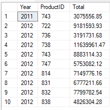
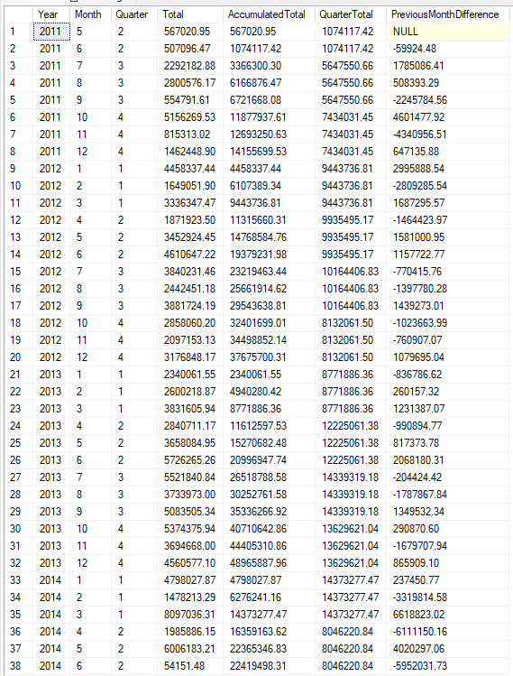
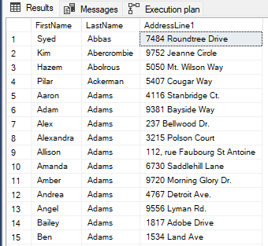

# Analyticalways backend technical test

This technical test is separated into 2 areas, `C#` and `SQL`. 

When you have it ready, make a `.zip`  file and mail it to the provided email address.

Please, write your notes and explanations of why you made your decisions in a markdown file in the root of the project.

## C#

Acme Corporation has created a Web API and, so far, it only has one entity of type `Person` but they plan to add many others later on.

Before continue creating new endpoints, they consider it is important to add testing to the solution.

Therefore, they have asked you to do the following:

- Add an integration test for the `PersonsController`.
  - *By integration test, they understand a test that uses a real DB and, moreover, they want to test each action in the controller.*
  - We know that there is some confusion between the differences of an integration test and a functional test. What they really want is to test the API as a black box, consuming it as an end user. Logically, the API will access a real DB (they don't like to use in-memory DBs in functional tests), then it will be very important to manage the known state of the DB for each test.
- Add a couple of business rules that they forgot in the MVP:
  - A person's name has to be unique.
  - A person has to be of legal age.
  - A person's document has to be a DNI, NIE or CIF and they also want to know what type of document is being saved. You have to save this information in a new field in the database.
  - To validate these business rules, they have said that they do not want to use Data Annotations decorators on the domain entity.
- Of course, you should add unit testing for these business rules too. 
  - They know that later on the business will become more complicated and they want to start from a good base.
  - *By unit testing, they understand a test that check the sut behavior in an isolated way, without dependencies*
- Finally, it seems that the `POST` method of the `PersonsController` allows you to send the Person `id` field and that's not right, you should do something about it.

For the third business rule, they have passed you this link https://asepyme.com/diferencias-entre-cif-nif-dni/ and even a quick summary that should enough in their opinion.

| Document type | Format                  |
| ------------- | ----------------------- |
| DNI           | 8 numbers + 1 letter    |
| NIF K         | K + 7 numbers  + letter |
| NIF L         | L + 7 numbers + letter  |
| NIF M         | M + 7 numbers + letter  |
| NIE X         | X + 7 numbers + letter  |
| NIE Y         | Y + 7 numbers + letter  |
| NIE Z         | Z + 7 numbers + letter  |

The good news is that Acme Corporation assumes that the MVP is very improvable, so they have not put any problem for you to make changes in the project structure, database, architecture, and so on. 

> Feel free to change everything you consider to achieve the final goal. In fact, there are things that you will have to change in order to achieve your testing strategy. In short, don't be afraid and make the code yours, you can do whatever you want, the limit is up to you.

Like they said in the beginning, it's important to explain the reason for your decisions.

### Database

To create the database:

```
dotnet tool install --global dotnet-ef
dotnet-ef database update --startup-project .\src\AcmeCorporationApi\AcmeCorporationApi.csproj
```

### Tests considerations

- You should use xUnit.net
- The tests should work with a just cloned repository. It is good practice for new team members.

## SQL

Regarding SQL, they seem to use it... and a lot, then they would like to know how you would solve the following statements taking the `AdventureWorks2016.bak` DB that is available at https://docs.microsoft.com/es-es/sql/samples/adventureworks-install-configure?view=sql-server-ver15&tabs=ssms.

Because understanding the problem is very important, the statement has been put in both English and Spanish.

### Query  1

*Returns the sum of sales by year and product, rounding the value to 2 decimal places, for the years 2011 and 2012 and for all those products whose product number starts with FR- and are black. In addition, only those rows whose sum of sales by year and product is greater than 3,000,000 should appear, all sorted by year and product id, both descending.*

> Devuelve la suma de las ventas por año y producto, redondeando el valor a 2 decimales, para los años 2011 y 2012 y para todos aquellos productos cuyo número de producto comience por FR- y sean de color negro. Además, sólo deberán aparecer aquellas filas cuya suma de ventas por año y producto sea mayor que 3.000.000, todo ello ordenado por año e id de producto, ambos descendentes.



### Query 2

Returns the sum of sales by year and month, rounded to 2 decimal places. It also should include the accumulated for the year up to the current month, the sum of sales for the quarter and the difference in sales with respect to the previous month.

> Devuelve la suma de las ventas por año y mes, redondeado a 2 decimales. Debería incluir también el acumulado del año hasta el mes actual, la suma de ventas del trimestre y la diferencia de ventas respecto al mes anterior.



> In this query, you should calculate almost everything with window functions.

### Query 3

Returns the first name and last name of the persons with their first address in alphabetical order, using `CROSS APPLY`.

> Devuelve el nombre y primer apellido de las personas junto a su primera dirección por orden alfabético, usando `CROSS APPLY`.



*The query should return 18.774 rows.*
